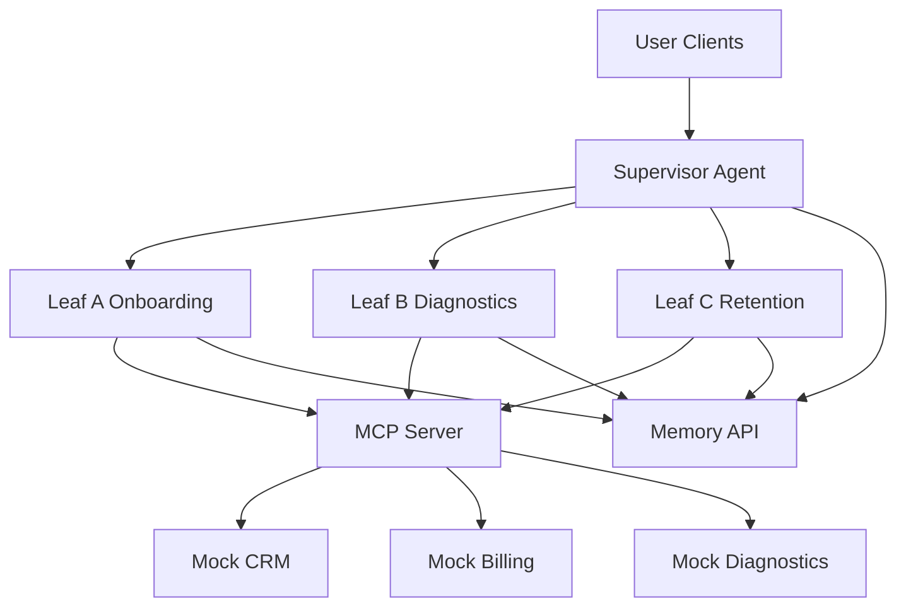
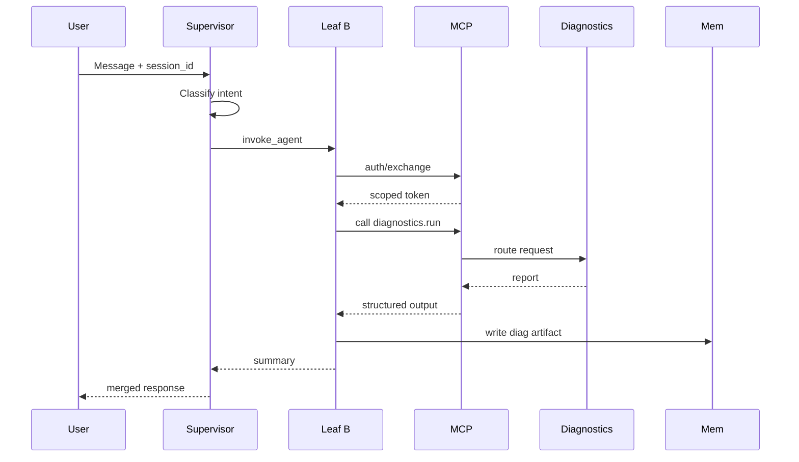
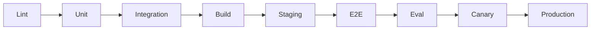

# Architecture

## System Overview

## Supervisor → Leaf → MCP Sequence

## Memory Schema

| Scope | ID Pattern | Key Fields |
|-------|------------|------------|
| session | `session:<id>` | turns[], redaction_mask, consent |
| profile | `user:<id>` | company, plan, churn_score |
| diagnostic | `diag:<id>` | integration_id, checks[], status |
| aggregate | agent aggregates | churn_score, repeated_issues |

## CI/CD Pipeline

